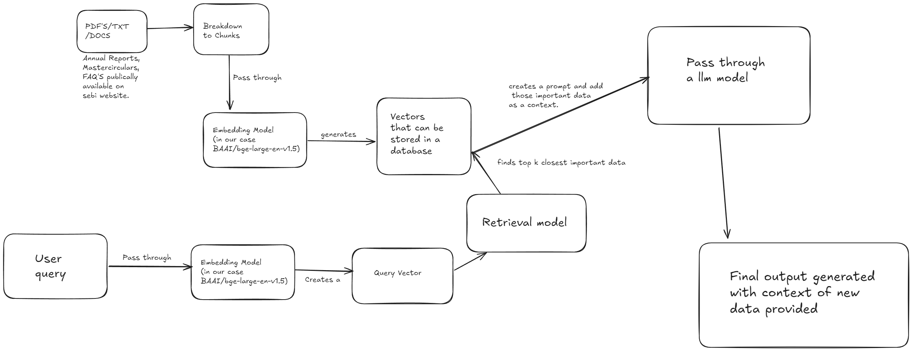

# SEBI RAG System with Integrated SCORES Portal

A comprehensive dual-portal system combining a Retrieval-Augmented Generation (RAG) system for SEBI regulatory queries with a fully functional SCORES (SEBI Complaint Redressal System) complaint portal.

## 🏛️ System Overview

This integrated platform provides:

### 🔍 **SEBI RAG System** (Port 5000)
- **Intelligent Document Query**: AI-powered responses from official SEBI documents
- **Registration Workflows**: Step-by-step intermediary registration guidance
- **Compliance Management**: Comprehensive compliance tracking and reporting
- **Interactive Chatbot**: Context-aware assistance for regulatory queries

### ⚖️ **SCORES Complaint Portal** (Port 5001)
- **Complete Complaint Lifecycle**: Registration → Lodge → Track → Escalate → Close
- **Conversational Interface**: Chat-based complaint filing and management
- **Document Upload**: Multi-file support with validation (up to 10 files, 20MB each)
- **Real-time Tracking**: Status updates with timeline visualization
- **Automated Workflows**: Guided processes for all complaint operations

### 🔗 **Seamless Integration**
- **Unified Navigation**: Cross-portal linking with consistent UI/UX
- **Shared Knowledge Base**: Same RAG system powers both portals
- **Single Installation**: One setup process for complete functionality
- **Consistent Branding**: Matching SEBI visual identity across both systems

## 🚀 Technology Stack

- **AI/ML**: Local embeddings (BAAI/bge-large-en-v1.5), Groq API (Llama 3.3 70B)
- **Backend**: Flask, ChromaDB, SQLite, LangChain
- **Frontend**: HTML5, CSS3, JavaScript ES6+
- **Data**: Official SEBI documents (Annual Reports, Master Circulars, FAQs)

## 🏗️ System Architecture



*The system architecture diagram above illustrates the complete data flow and integration between the SEBI RAG System and SCORES Portal, showing how both systems leverage the shared knowledge base and maintain seamless user experience.*

### Architecture Highlights:
- **Unified RAG Core**: Single knowledge base serving both portals
- **Dual Interface Design**: Web-based portals with consistent UI/UX
- **Cross-Portal Integration**: Seamless navigation and shared functionality
- **Scalable Backend**: Flask applications with modular design
- **Local Processing**: Privacy-focused with local embeddings and vector storage

## 📁 Project Structure

```
sebi-rag-system/
├── 🏠 Main SEBI RAG System
│   ├── app.py                      # Main Flask application (Port 5000)
│   ├── index.html                  # Main portal interface
│   ├── run.py                      # Application launcher
│   ├── css/
│   │   └── styles.css              # Main system styling
│   ├── js/
│   │   ├── chatbot.js              # Main chatbot functionality
│   │   ├── rag-integration.js      # RAG system integration
│   │   └── workflows.js            # Registration workflows
│   └── images/
│       └── sebi-logo.png           # SEBI logo (shared)
│
├── ⚖️ SCORES Complaint Portal
│   ├── scores/
│   │   ├── app_scores.py           # SCORES Flask app (Port 5001)
│   │   ├── index.html              # SCORES portal interface
│   │   ├── styles.css              # SCORES styling (consistent with main)
│   │   ├── script.js               # SCORES chatbot and workflows
│   │   ├── scores.db               # SQLite database (auto-created)
│   │   └── uploads/                # File upload directory (auto-created)
│
├── 🤖 RAG Core System
│   ├── src/
│   │   ├── __init__.py             # Package initialization
│   │   ├── sebi_rag_system.py      # Core RAG implementation
│   │   ├── sebi_document_loader.py # Document processing
│   │   ├── sebi_chat_full.py       # CLI interface
│   │   └── setup_rag.py            # Setup and validation
│
├── 📊 Data & Knowledge Base
│   ├── data/
│   │   ├── outputs/                # Processed document chunks
│   │   ├── sebi_annual_reports/    # Annual report data
│   │   ├── sebi_faqs/              # FAQ data
│   │   ├── sebi_mastercirculars/   # Master circular data
│   │   └── sebi_chroma_db/         # Vector database
│
├── 🔧 Configuration & Setup
│   ├── requirements.txt            # Python dependencies
│   ├── .env.example                # Environment template
│   ├── .env                        # Environment variables
│   └── test_scores_integration.py  # Integration tests
```

## 🚀 Quick Start Guide

### Prerequisites
- **Python 3.8+**
- **Git** with LFS support
- **Modern web browser**
- **4GB+ RAM** (recommended)

### 1. Installation
```bash
# Clone repository
git clone https://github.com/shivin4/RAGSebi.git
cd sebi-rag-system

# Install dependencies
pip install -r requirements.txt

# Setup environment
cp .env.example .env
# Edit .env and add your GROQ_API_KEY=your_key_here
```

### 2. Get Groq API Key
1. Visit [Groq Console](https://console.groq.com/)
2. Sign up for free account
3. Generate API key
4. Add to `.env` file

### 3. Verify Setup
```bash
# Run setup validation
python src/setup_rag.py
```

### 4. Launch Both Systems
```bash
# Terminal 1: Main SEBI RAG System
python run.py
# Access at: http://localhost:5000

# Terminal 2: SCORES Complaint Portal
python scores/app_scores.py
# Access at: http://localhost:5001
```

## 💻 Usage Guide

### 🏠 Main SEBI RAG System (localhost:5000)

#### Interactive Features
- **📋 Registration Workflows**: Complete intermediary registration guidance
- **✅ Eligibility Checker**: Verify requirements by intermediary type
- **📊 Compliance Tracking**: Category-specific reporting requirements
- **🤖 AI Assistant**: RAG-powered regulatory query resolution

#### Sample Queries
```
💭 What are the portfolio manager registration requirements?
💭 Explain SEBI's new master circular for 2025
💭 What documents are needed for stock broker registration?
💭 What are the compliance requirements for mutual funds?
```

### ⚖️ SCORES Portal (localhost:5001)

#### Complete Workflow Support
1. **👤 User Registration**
   - PAN validation and account creation
   - Auto-generated credentials
   - Secure password hashing

2. **📝 Complaint Filing**
   - Entity type selection (Stock Broker, Mutual Fund, etc.)
   - Category-based complaint classification
   - Multi-file document upload
   - Unique complaint ID generation

3. **📊 Tracking & Management**
   - Real-time status updates
   - Timeline visualization
   - Escalation workflows (L1 → L2 → SEBI Officer)
   - Feedback collection and closure

#### Chatbot Commands
```
🗣️ "register" - Start user registration
🗣️ "lodge complaint" - File new complaint
🗣️ "track [complaint_id]" - Check status
🗣️ "escalate [complaint_id]" - Escalate complaint
🗣️ "help" - Get assistance
```

## 🔄 Cross-Portal Integration

### Unified Navigation
- **Main → SCORES**: Click "SCORES Complaints" in header (red pulse indicator)
- **SCORES → Main**: Click "SEBI" in header navigation
- **Consistent UI**: Matching design, colors, and typography

### Shared Knowledge Base
Both portals access the same RAG system for:
- **Regulatory Queries**: Same AI assistant across both systems
- **Document References**: Consistent source attribution
- **Context Awareness**: Shared understanding of SEBI regulations

## 🛠️ API Documentation

### Main System APIs (Port 5000)
| Endpoint | Method | Description |
|----------|--------|-------------|
| `/` | GET | Main portal homepage |
| `/api/health` | GET | System health check |
| `/api/stats` | GET | RAG system statistics |
| `/api/query` | POST | Query RAG system |
| `/images/<file>` | GET | Serve image assets |
| `/css/<file>` | GET | Serve CSS files |
| `/js/<file>` | GET | Serve JavaScript files |

### SCORES System APIs (Port 5001)
| Endpoint | Method | Description |
|----------|--------|-------------|
| `/` | GET | SCORES portal homepage |
| `/api/health` | GET | System health check |
| `/api/register` | POST | User registration |
| `/api/lodge` | POST | Lodge complaint |
| `/api/track` | POST | Track complaint status |
| `/api/review` | POST | Escalate complaint |
| `/api/close` | POST | Close complaint |
| `/api/query` | POST | Query knowledge base |
| `/uploads/<file>` | GET | Serve uploaded files |

## 🗄️ Database Schema

### SCORES Database (SQLite)

#### Users Table
```sql
CREATE TABLE users (
    user_id TEXT PRIMARY KEY,        -- Format: SCR{YYYYMMDD}{random}
    name TEXT NOT NULL,
    pan TEXT UNIQUE NOT NULL,        -- 10-character PAN
    email TEXT NOT NULL,
    mobile TEXT NOT NULL,            -- 10-digit mobile
    dob TEXT NOT NULL,               -- DD/MM/YYYY format
    password_hash TEXT NOT NULL,     -- Bcrypt hash
    created_at TEXT NOT NULL         -- ISO timestamp
);
```

#### Complaints Table
```sql
CREATE TABLE complaints (
    complaint_id TEXT PRIMARY KEY,  -- Format: SCR{YYYYMMDDHHMMSS}{random}
    user_id TEXT NOT NULL,
    entity_type TEXT NOT NULL,      -- Stock Broker, Mutual Fund, etc.
    category TEXT NOT NULL,         -- Specific issue category
    description TEXT NOT NULL,
    files TEXT,                     -- JSON array of file paths
    status TEXT DEFAULT 'submitted', -- Status progression
    created_at TEXT NOT NULL,
    updated_at TEXT NOT NULL,
    escalation_level INTEGER DEFAULT 1,
    FOREIGN KEY (user_id) REFERENCES users (user_id)
);
```

#### Complaint History Table
```sql
CREATE TABLE complaint_history (
    id INTEGER PRIMARY KEY AUTOINCREMENT,
    complaint_id TEXT NOT NULL,
    status TEXT NOT NULL,
    notes TEXT,
    created_at TEXT NOT NULL,
    FOREIGN KEY (complaint_id) REFERENCES complaints (complaint_id)
);
```

## 🎨 User Interface Design

### Design Consistency
- **Color Scheme**: SEBI blue gradient (#1e3a8a → #3b82f6)
- **Typography**: Segoe UI font family
- **Icons**: Font Awesome 6.0 icons
- **Layout**: Responsive grid system
- **Components**: Consistent buttons, cards, and forms

### Responsive Features
- **Mobile Optimization**: Touch-friendly interfaces
- **Adaptive Layouts**: Flexible grid systems  
- **Progressive Enhancement**: Core functionality without JavaScript
- **Accessibility**: WCAG 2.1 AA compliance

## 🔒 Security & Privacy

### Data Protection
- **Local Processing**: All data processed locally
- **Secure Storage**: Bcrypt password hashing
- **Input Validation**: Client and server-side validation
- **File Security**: Type and size validation for uploads
- **SQL Injection Prevention**: Parameterized queries

### Privacy Features  
- **No External Tracking**: No analytics or tracking scripts
- **Local Storage**: Browser-only session data
- **API Key Protection**: Environment variable storage
- **Secure Sessions**: Server-side session management

## 📊 Performance Specifications

### System Requirements
- **RAM**: 4GB minimum, 8GB recommended
- **Storage**: 2GB for application and data
- **Network**: Internet for Groq API calls
- **Browser**: Modern browser with ES6+ support

### Performance Metrics
- **Setup Time**: 2-3 minutes first run
- **Query Response**: 3-5 seconds average
- **Memory Usage**: 2-3GB during operation
- **Storage Usage**: ~500MB vector database
- **Concurrent Users**: Multiple web sessions supported

## 🚨 Troubleshooting Guide

### Common Issues

#### 1. Port Conflicts
```bash
# If default ports are in use
# Change port in app.py: app.run(port=5002)
# Change port in app_scores.py: app.run(port=5003)
```

#### 2. API Key Issues
```bash
# Verify API key
echo $GROQ_API_KEY
# Check key validity at Groq Console
# Ensure no extra spaces in .env file
```

#### 3. Database Issues
```bash
# Reset SCORES database
rm scores/scores.db  # Will be recreated automatically

# Reset vector database
rm -rf data/sebi_chroma_db/  # Run setup_rag.py to rebuild
```

#### 4. File Upload Problems
```bash
# Check permissions
chmod 755 scores/uploads/
# Check disk space
df -h
# Verify upload directory exists
mkdir -p scores/uploads
```

#### 5. Memory Issues
```bash
# Monitor memory usage
# Close other applications
# Consider cloud deployment for heavy usage
```

### Debug Mode
```bash
# Enable Flask debug mode
export FLASK_DEBUG=1
python app.py
python scores/app_scores.py
```

## 🧪 Testing

### Integration Testing
```bash
# Test complete system integration
python test_scores_integration.py

# Test individual components
python src/setup_rag.py  # RAG system
curl http://localhost:5000/api/health  # Main system
curl http://localhost:5001/api/health  # SCORES system
```

### Manual Testing Workflows
1. **Main System**: Registration workflow, compliance queries, chatbot
2. **SCORES System**: User registration, complaint filing, tracking
3. **Integration**: Cross-navigation, shared knowledge base
4. **File Upload**: Multiple files, size/type validation

## 🔧 Development & Customization

### Adding Features

#### Main System Enhancements
```python
# Add new workflow in js/workflows.js
function newWorkflow() {
    // Custom workflow implementation
}

# Add new API endpoint in app.py
@app.route('/api/new-feature', methods=['POST'])
def new_feature():
    return jsonify({"status": "success"})
```

#### SCORES Portal Enhancements  
```python
# Add new complaint category in scores/script.js
const categoryMap = {
    'New Entity Type': ['Category 1', 'Category 2'],
    // ... existing categories
}

# Add new database field in scores/app_scores.py
def create_user(self, user_data):
    user_data['new_field'] = 'value'
    # ... existing logic
```

### Code Standards
- **Python**: PEP 8 compliance
- **JavaScript**: ES6+ standards, JSDoc comments
- **HTML/CSS**: Semantic markup, BEM methodology
- **Error Handling**: Comprehensive try-catch blocks
- **Logging**: Detailed logging for debugging

## 🤝 Contributing

### Development Setup
```bash
# Create development environment
git clone https://github.com/shivin4/RAGSebi.git
cd sebi-rag-system
python -m venv venv
source venv/bin/activate  # Windows: venv\Scripts\activate
pip install -r requirements.txt

# Create feature branch
git checkout -b feature/new-enhancement

# Test changes
python run.py  # Test main system
python scores/app_scores.py  # Test SCORES
python test_scores_integration.py  # Run tests

# Submit changes
git add .
git commit -m "feat: add new enhancement"
git push origin feature/new-enhancement
```

### Contribution Areas
- **UI/UX Improvements**: Enhanced user interfaces
- **New Workflows**: Additional SEBI processes
- **Performance Optimization**: Speed and efficiency improvements
- **Documentation**: User guides and API documentation
- **Testing**: Unit tests and integration tests

## 📄 License

This project is for educational and research purposes. Please ensure compliance with:
- **SEBI Terms**: Official document usage terms
- **API Terms**: Groq API usage policies
- **Open Source**: Respect for open source dependencies

## 🙏 Acknowledgments

- **SEBI**: For comprehensive regulatory documentation
- **Groq**: For fast LLM inference API
- **HuggingFace**: For open-source embedding models
- **LangChain**: For RAG framework architecture
- **ChromaDB**: For vector database solution
- **Flask**: For web application framework
- **Font Awesome**: For iconography
- **Open Source Community**: For foundational libraries

## 📞 Support & Contact

### Getting Help
1. **📖 Documentation**: Check this README and inline comments
2. **🔧 Setup Issues**: Run `python src/setup_rag.py` for diagnostics
3. **🌐 Web Issues**: Check browser developer console
4. **🔍 Debug**: Enable Flask debug mode for detailed errors

### Community Support
- **GitHub Issues**: Bug reports and feature requests
- **Integration Testing**: Use `test_scores_integration.py`
- **Setup Validation**: Use `src/setup_rag.py` for system checks

### System Status Checks
```bash
# Health check both systems
curl http://localhost:5000/api/health
curl http://localhost:5001/api/health

# Check RAG system stats  
curl http://localhost:5000/api/stats

# Test database connectivity
python -c "import sqlite3; print('SQLite OK')"
```

---

## 🌟 Key Features Summary

### 🏠 Main SEBI RAG Portal
✅ **AI-Powered Queries** - Intelligent responses from SEBI documents  
✅ **Registration Workflows** - Step-by-step intermediary guidance  
✅ **Compliance Tracking** - Category-specific reporting requirements  
✅ **Eligibility Checker** - Automated requirement validation  
✅ **Interactive Chatbot** - Context-aware regulatory assistance  

### ⚖️ SCORES Complaint Portal  
✅ **Complete Lifecycle Management** - End-to-end complaint handling  
✅ **Conversational Interface** - Chat-based filing and tracking  
✅ **Document Upload** - Multi-file support with validation  
✅ **Real-time Tracking** - Status updates and timeline visualization  
✅ **Automated Workflows** - Guided processes for all operations  
✅ **Escalation Management** - L1 → L2 → SEBI Officer progression  

### 🔗 Integrated Experience
✅ **Seamless Navigation** - Cross-portal linking  
✅ **Unified Design** - Consistent SEBI branding  
✅ **Shared Knowledge** - Same RAG system across portals  
✅ **Single Setup** - One installation for both systems  
✅ **Cross-References** - Contextual links between systems  

---

**⚠️ Disclaimer**: This is a demonstration system for educational purposes. For official SEBI services, please use:
- **SEBI Official Website**: https://www.sebi.gov.in
- **Official SCORES Portal**: https://scores.gov.in
- **SEBI Intermediary Portal**: Official SEBI registration portals

**🔒 Privacy**: All data processing is performed locally. Only LLM queries are sent to Groq API for processing.
